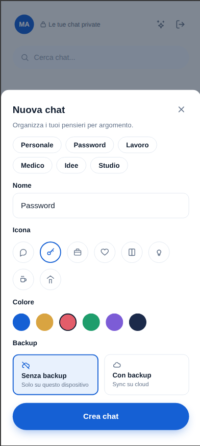
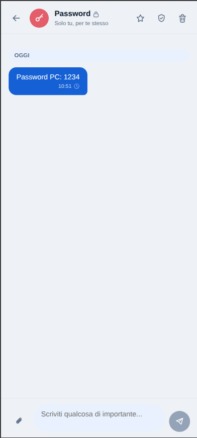
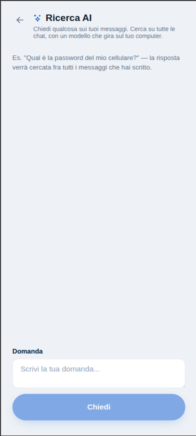

# Solo

> Uno spazio silenzioso, solo per te.

**Solo** è un'app personale di journaling/messaggistica-a-se-stessi: niente contatti, niente rumore,
solo i messaggi che contano — organizzati in chat tematiche (Password, Lavoro, Medico, Idee,
Studio, ...), con backup cloud opzionale, sync multi-dispositivo e una ricerca AI locale su tutti i
propri messaggi.

Progetto realizzato nell'ambito della **Summer Playtime Challenge** (Onetag, Coders Track — Sessione
7, luglio 2026): tre settimane per costruire qualcosa di proprio seguendo il metodo di lavoro visto
nelle sei sessioni precedenti — spec prima del codice, review pass sul lavoro dell'AI, e un
`CLAUDE.md`/`AGENTS.md` che permetta a un modello (o a una persona) nuovo di riprendere il progetto
senza dover rileggere tutta la cronologia.

## Overview dell'app

| | | |
|---|---|---|
|  |  |  |
| **Welcome** — value proposition: essenziale, privato, minimale | **Login** — email/password (Google Sign-In supportato lato backend) | **Lista chat** — vuota al primo accesso, una chat privata per argomento |
|  |  |  |
| **Nuova chat** — nome, categoria predefinita, icona, colore, backup on/off | **Thread** — es. una chat "Password" con un messaggio a se stessi | **Ricerca AI** — domande in linguaggio naturale su tutti i propri messaggi, con un modello che gira in locale (nessuna API cloud) |

Il flusso in breve: **Welcome → Login/Registrazione → Lista chat (vuota) → Crea chat per argomento →
Scrivi messaggi a te stesso → (opzionale) Chiedi alla Ricerca AI di ritrovarli.**

## Struttura del repository

```
solo/
├── backend/    # API Spring Boot (auth, chat, messaggi, sync, recovery, ricerca AI)
└── frontend/   # Web app React/Vite, client del backend
```

Ogni cartella ha la propria documentazione di dettaglio — questo README dà solo la vista d'insieme:

| Percorso | Cosa contiene |
|---|---|
| [`backend/CLAUDE.md`](backend/CLAUDE.md) | Guida per un agente AI (o uno sviluppatore) che riprende il backend: stack, comandi, convenzioni, gap noti |
| [`backend/SPEC.md`](backend/SPEC.md) | Specifica funzionale del backend — l'intento a cui il codice deve rispondere |
| [`backend/REVIEW.md`](backend/REVIEW.md) | Review pass sul codice generato dall'AI: finding, severità, stato (fixed/open/accettato) |
| [`frontend/README.md`](frontend/README.md) | Stack, comandi e struttura del client web |

## Stack tecnico

**Backend** — Java 21, Spring Boot 3.5.11, Maven
- Spring Web + Spring Data JPA (MySQL 8, migrazioni Liquibase)
- Spring Security con JWT (+ Google Sign-In)
- AWS S3 per il contenuto di messaggi/allegati
- Postgres + pgvector e Spring AI (MCP server) per la ricerca AI locale, appoggiata a un'istanza
  **LM Studio** in esecuzione sulla macchina dell'utente — nessuna API AI cloud coinvolta

**Frontend** — React 19 + TypeScript, Vite, React Router, Axios

## Come avviare il progetto

Backend:

```bash
cd backend
docker compose -f local/db/docker-compose.yml up -d   # MySQL locale
JWT_SECRET=<almeno-64-caratteri> ./mvnw spring-boot:run # gira su :8088
```

Frontend:

```bash
cd frontend
cp .env.example .env   # VITE_API_BASE_URL=http://localhost:8088
npm install
npm run dev
```

Dettagli completi (variabili d'ambiente, ricerca AI opzionale, comandi di lint/test) nei rispettivi
`CLAUDE.md`/`README.md` linkati sopra.

## Il metodo: spec → build → review

Coerente con le istruzioni della challenge, ogni parte del backend porta con sé:

1. una **spec** scritta prima (o, dove reverse-documentata, subito dopo) l'implementazione,
2. un **review pass** dedicato sul codice prodotto con l'AI, verificato a mano finding per finding,
3. un **CLAUDE.md** che rende esplicite le convenzioni e i compromessi presi, così che il prossimo
   intervento — umano o AI — non debba riscoprirli da zero.

L'obiettivo non è solo l'app finita, ma che il modo in cui è stata costruita sia leggibile quanto il
codice stesso.